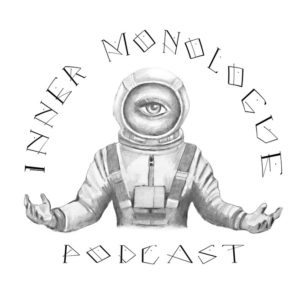

\[caption id="attachment\_16105" align="aligncenter" width="337"\] Mental Health, Art & Creativity and the Trials & Tribulations we experience in life.\[/caption\]

> ### _**"This conversation delves into a wide range, including the politics of prevention, how to multi-task passion projects, family life and how to ultimately find a balance in one's life."**_
> 
> ### _**~Thomas Brown**_

A few months back I had the chance to chat with Thomas Brown from Inner Monologue, and had such a great time! We talked about everything from music to children, suicide prevention to my coffee habit, and all things in between.

I met Thomas a few months before this interview just after I was presented the Loss Survivor of 2017 Award at the American Association of Suicidology (AAS) conference, this past spring. I was emotional during my acceptance speech, and had the sinus snot to prove it. On my way outside for a quick smoke, this long haired hippy looking dude stops me and starts complimenting me, and asking if he could talk to me while I smoked, who am I to stop someone from continuing their daily compliment tally? I found out that he is actually a super cool guy, with tons of passion himself for the mental health and suicide prevention field.

So please, take some time and listen in! Love your faces!

[Episode 91-Inner Monologue Podcast with Kate Hardy](http://www.risephoenix.org/inner-monologue/91-kate-hardy-dedication-to-building-a-self-sustaining-community)

Kate
