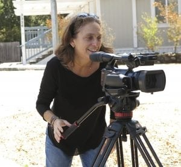

**Ian Boyle, Events and Booking Coordinator** Ian is a seasoned SIS volunteer who has been involved with the music industry for most of his adult life. He was propelled into his loss survivorship after losing one of his best friends, Jason Lockwood, in 2012. Ian plans to use his many connections to artists, venues and booking agents to help spread the message of SFO. He believes that SFO/SIS can create long-lasting partnerships that can increase our presence through the community and help bring the conversation to new places and people. Ian currently lives in Metro Detroit with his girlfriend and their dog.

 

**Leela Chandrasekar, Physician/Medical Advisor** Leela is a fourth-year medical student at Central Michigan University College of Medicine and is currently completing senior rotations at St. Johns Hospital in Detroit. She has always been passionate about working with children and has learned a great deal about mental health from her experience working with the adolescent population in metro Detroit. She first became interested in Six Feet Over via the organization's involvement in education. As a health care provider, Leela believes the most powerful tool with which she can equip her patients is knowledge. Her goal is to encourage everyone, especially children, to become active participants in both their health care and mental health care.

 

**Lisa Klein, Brand Ambassador, Visual Media** Lisa is an award-winning director and writer dedicated to crafting groundbreaking documentary features. Her current project, _The S Word_, tackles one of the most cloistered issues of our time through the emotional stories of suicide attempt and loss survivors. Previously, Lisa co-directed _Of Two Minds_, a journey into the lives of people living, struggling, and triumphing with bipolar condition. Lisa tours the country speaking and using her films to raise awareness of mental health issues. She is also the co-founder, along with her husband Doug Blush, of MadPix Inc., an LA-based production company dedicated to producing character-driven stories that create global impact and social change. Lisa is a graduate of the University of Michigan and received an M.F.A. from the University of Southern California.
